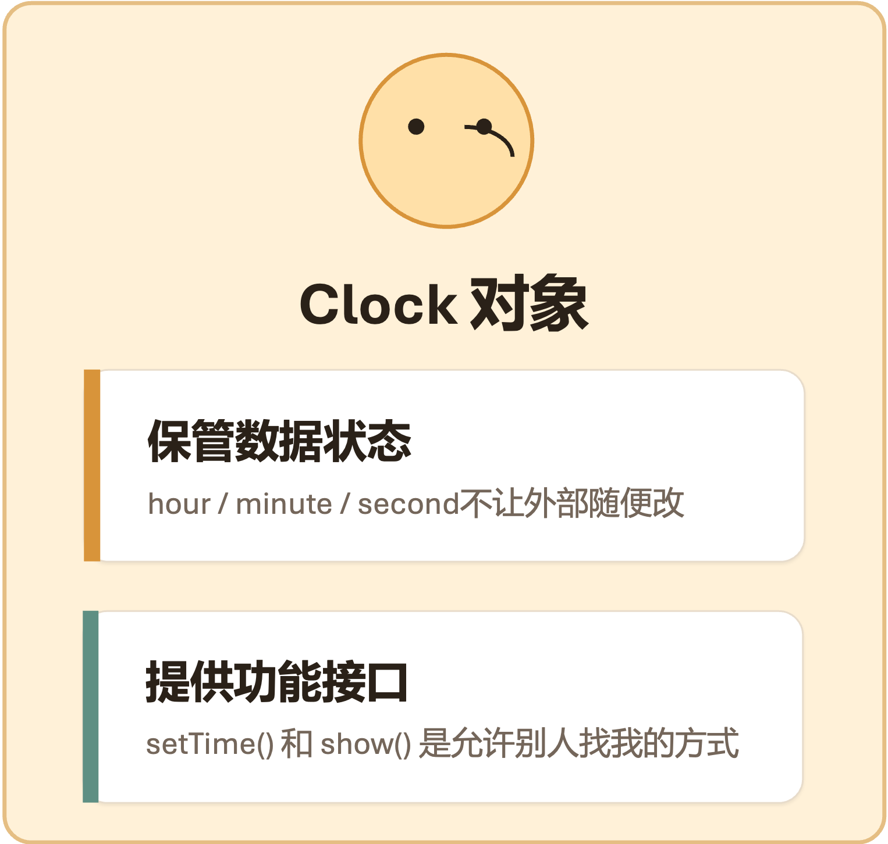
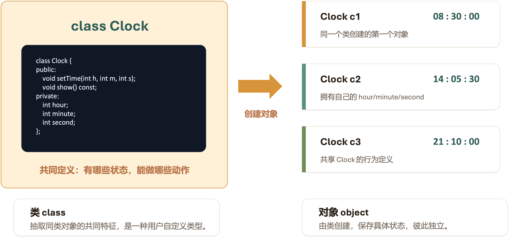

# 构造函数与对象初始化

先从 C 语言的组织方式出发，了解面向对象程序设计要解决的问题。

## C程序的组织方式

!!! question "C语言如何管理和使用自定义数据类型？"

- 用结构体把相关数据放在一起。
- 用函数处理这些结构体数据。
- 调用者负责按照约定调用函数并维护合法状态。
- 当数据和规则越来越多时，约定容易散落在不同文件中。

### C示例：struct Clock

#### 声明自定义数据类型

时钟的状态可以用结构体表达，一个结构体就是一种自定义数据类型。

!!! example "struct Clock"

    ``` c linenums="1"
    typedef struct {
        int hour;
        int minute;
        int second;
    } Clock;
    ```

!!! warning "基于结构体的自定义数据类型"

    - **状态集中** ：`hour`、`minute`、`second` 放在同一个结构体中
    - **字段公开** ：C 结构体字段默认可以被外部直接访问
    - **规则不在结构体里** ：合法性检查需要依赖外部函数或调用者自觉

#### 用函数操作结构体

函数负责修改 Clock，由函数逻辑保证数据的约束规则，但数据本身仍然是公开的。

!!! example "用函数操作结构体"

    ``` c linenums="6"
    void setTime(Clock* c, int h, int m, int s) {
        if (h >= 0 && h < 24 &&
            m >= 0 && m < 60 &&
            s >= 0 && s < 60) {
            c->hour = h;
            c->minute = m;
            c->second = s;
        }
    }
    ```

!!! warning "函数无法完全限制对结构体的访问规则"

    - **规则在函数中** ：只要调用 `setTime()`，时间范围就能被检查。
    - **问题还没消失** ：调用者仍然可以绕过 `setTime` 直接写字段。

#### 数据可以被任意修改

对公开数据的直接赋值可能破坏对象的合法状态。

!!! example "绕过函数直接修改数据"

    ``` c linenums="15"
    Clock c;
    setTime(&c, 8, 30, 0);

    c.minute = 99;      // 绕过规则
    c.second = -1;      // 状态非法

    showClock(&c);
    ```

!!! warning "数据可能被置于错误状态"

    - **非法状态** ：`minute` 不应该是 99，`second` 不应该是负数。
    - **责任落在调用者身上** ：每个调用者都必须记住字段的含义和范围。
    - **维护风险** ：项目越大，越难保证所有地方都遵守规则。

### C带来的问题

程序变大后，对数据的访问规则会散落在各处，而大型程序需要更强的组织边界。我们希望把字段和规则绑定得更紧。

- 字段含义写在注释里，调用者可能没看到。
- 合法性检查写在某些函数里，但不是所有修改路径都会调用它。
- 多人协作时，不同文件可能用不同方式修改同一类数据。
- 修复错误时，需要追踪所有直接访问字段的位置。

## C++的方法：面向对象程序设计

> Object-Oriented Programming，OOP

### 让对象自己管理状态和规则

对象不仅是数据的容器，它也负责维护数据的使用规则。

{ width="300" }

??? question "如果 minute 被直接改成 99，谁应该负责阻止这件事？"

    - **限制直接修改字段** ：用户不能够随意修改 `hour`、`minute`、`second` 这些字段。
    - **必须通过接口访问** ：用户必须通过 `setTime()` 接口函数来修改字段的状态。
    - **规则定义在接口中** ：`setTime()` 接口函数中应声明合法性检查规则

### 把同类对象封装为类

类描述一类对象的共同结构和行为，是程序中的代码模块；对象保存自己的具体状态，是程序中的运行实例。

{ width="700" }

### OOP的基本特征

#### 抽象

> Abstraction

抽象不是把所有细节都搬进程序，而是为当前问题保留必要特征，其核心是 “简化” 和 “建模”。

- 从复杂的现实世界中，提炼出与当前问题域相关的核心本质，并忽略无关的细节，保留对解决问题有意义的状态和行为。
- 降低复杂性，让程序员能够关注于“做什么”，而不是“如何做”。
- 在面向对象程序中，通常用类(class)和接口(interface)表达抽象设计，一个设计良好的类，其名称和公开方法就清晰地表达了它的抽象意图。

#### 封装

> Encapsulation

封装是实现抽象的手段，让程序模块拥有边界和约束，也让错误更容易被定位。

- 用内部保存的数据表示对象状态，例如 `Clock` 的 `hour`、`minute`、`second`，对外隐藏对象的内部实现细节。
- 用对外提供的操作表示对象行为，例如 `setTime()` 和 `show()`，外部调用必须通过公开接口进行访问。
- 用行为逻辑约束对象必须遵循的规则，例如 `minute` 必须在 0 到 59 之间，保护对象状态的完整性，防止外部代码随意修改而导致程序出错。

#### 继承

> Inheritance

继承是构建类之间 “is-a” 关系的方式，可以减少面向对象程序中的重复代码，提高代码重用性。

- 允许一个类（子类/派生类）继承另一个类（父类/基类）的属性和方法。
- 实现代码复用，并建立层级化的类型结构。

#### 多态

> Polymorphism

多态是面向对象设计的精髓，意味着 “一个接口，多种方法”。

- 允许你用父类的指针或引用来调用子类中重写（override）的方法。
- 让程序具有更好的扩展性，可以基于统一的接口处理不同类型的对象。

## 面向对象程序设计方法

程序由封装数据与行为的类模块组成，通过对象间的协作交互执行程序功能。

- 先识别系统里有哪些对象
- 再判断每个对象应该保存什么状态
- 继续判断每个对象应该提供什么行为
- 最后让对象通过公开接口协作完成任务

### OOP关注对象的责任与协作

过程式程序重在步骤，对象式程序重在责任。

!!! example "C：调用者负责遵守规则"

    ``` c linenums="1"
    typedef struct {
        int hour;
        int minute;
        int second;
    } Clock;

    void setTime(Clock* c, int h, int m, int s);

    Clock c;
    c.minute = 99;   // 外部可绕过规则
    ```

!!! warning "责任分散：每个调用点都可能成为错误入口。"

!!! example "C++：类型自己维护规则"

    ``` c linenums="1"
    class Clock {
    public:
        void setTime(int h, int m, int s);
        void show() const;
    private:
        int hour {0};
        int minute {0};
        int second {0};
    };

    Clock c;
    c.setTime(8, 30, 0);

    // c.minute = 99;
    // private 成员不可直接访问
    ```

!!! info "责任集中：对象把规则封装在自己的接口里。"

### 一个完整的C++示例

!!! example "C++：抽象、封装、继承、多态"

    ``` c linenums="1"
    #include <iostream>
    using namespace std;

    // 1. 抽象：定义一个 "可绘制" 的抽象基类 (接口)
    class Drawable {
    public:
        // 纯虚函数，提供接口但不实现
        virtual void draw() const = 0; 
        // 虚析构函数确保正确清理派生类
        virtual ~Drawable() = default; 
    };

    // 2. 封装 + 继承：具体形状类继承自 Drawable
    class Circle : public Drawable {
    private: // 封装：将内部数据设为私有
        double radius_; 
        double x_, y_;

    public:
        // 构造函数，用于初始化封装的数据
        Circle(double r, double x, double y) : radius_(r), x_(x), y_(y) {}

        // 多态：重写 (override) 基类的虚函数
        void draw() const override {
            cout << "Drawing a Circle at (" << x_ << ", " << y_ 
                << ") with radius " << radius_ << endl;
        }
    };

    class Square : public Drawable {
    private:
        double side_;
        double x_, y_;

    public:
        Square(double s, double x, double y) : side_(s), x_(x), y_(y) {}

        void draw() const override {
            cout << "Drawing a Square at (" << x_ << ", " << y_ 
                << ") with side " << side_ << endl;
        }
    };

    // 3. 多态的运用：统一的接口处理不同的类型
    void render(const Drawable& shape) {
        shape.draw(); // 运行时多态：具体调用哪个 draw() 由对象类型决定
    }

    int main() {
        Circle c(5.0, 10, 20);
        Square s(4.0, 30, 40);

        render(c); // 输出: Drawing a Circle...
        render(s); // 输出: Drawing a Square...

        return 0;
    }
    ```