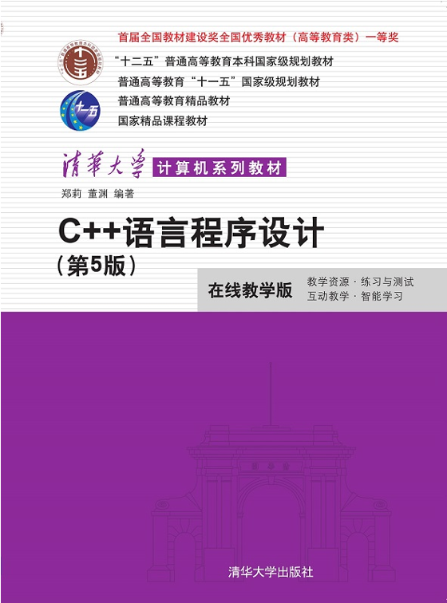
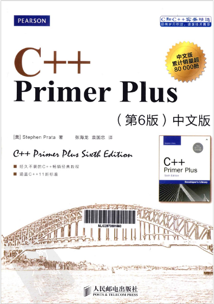
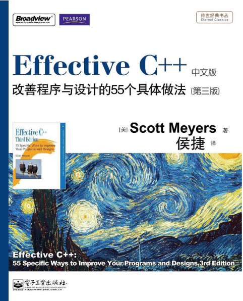
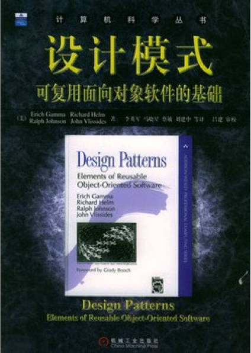

# 课程简介

本课程是面向对象程序设计的入门课程，以C++语言为载体，系统讲授面向对象程序设计的基本思想、方法和技术。
课程旨在帮助学生建立面向对象的思维方式，掌握使用C++解决实际工程问题的能力。

## 课程定位

### 课程性质

面向对象程序设计是计算机及相关专业的**核心基础课程**，在知识体系中起着承上启下的关键作用。
本课程向前承接结构化程序设计方法，向后为数据结构、算法设计、软件工程等课程奠定面向对象的思维基础。

!!! info "课程在知识体系中的位置"

    ```
    程序设计基础（C语言） → 本课程（C++与面向对象） → 数据结构与算法 → 软件开发实践
    ```

### 课程目标

本课程的核心是 **“基于C++的面向对象程序设计方法”**。
课程不仅讲授C++的语法特性，更注重培养学生**用面向对象的思维分析和解决问题**的能力。

!!! success "课程完成后，学生应能具备的知识与能力目标："

    1. **掌握C++语法**：熟练运用C++的主要语法特性，能够编写符合规范的C++程序。

    2. **理解面向对象思想**：深入理解封装、继承、多态三大核心特征，建立面向对象的思维方式。

    3. **掌握C++的面向对象机制**：能够合理运用类、继承、虚函数、模板等机制进行程序设计。

    4. **具备工程实践能力**：能够使用面向对象方法，借助相关开发工具和平台，用C++解决基本工程问题。

## 课程主要内容

本课程围绕面向对象程序设计的核心机制展开，覆盖以下主要内容：

!!! summary "课程内容模块"

    | 模块            | 主要内容                                                       |
    | :-------------- | :------------------------------------------------------------- |
    | **C++基础扩展** | C++对C的语法扩展、引用、函数重载、默认参数、命名空间等         |
    | **类与对象**    | 类的定义、对象的创建与使用、构造函数、析构函数、封装与信息隐藏 |
    | **继承与派生**  | 继承的基本概念、派生类的定义、继承方式、构造与析构的调用顺序   |
    | **多态性**      | 虚函数、抽象类、纯虚函数、运行时多态的机制与实现               |
    | **运算符重载**  | 运算符重载的规则、成员函数与非成员函数方式、常用运算符重载     |
    | **模板**        | 函数模板、类模板                                               |

## 教材与资源工具

### 教材

{ width="300" }

!!! info "**《C++语言程序设计（第5版）》**"

    - 作者：郑莉
    - 出版社：清华大学出版社
    - ISBN：9787302566915

### 参考书籍

{ width="300" }

!!! info "**《C++ Primer Plus（第6版）》**"

    - 作者：Stephen Parta
    - 出版社：人民邮电出版社
    - ISBN：9787115521644

{ width="300" }

!!! info "**《Effective C++ -- she改善程序与设计的55个具体做法（第3版）》**"

    - 作者：Scott Meyers
    - 出版社：电子工业出版社
    - ISBN：9787121123320

{ width="300" }

!!! info "**《设计模式：可复用面向对象软件的基础》**"

    - 作者：Erich Gamma，Richard Helm，Ralph Johnson，John Vlissides
    - 出版社：机械工业出版社
    - ISBN：9787111760238

### 参考资源

| 资源                  | 说明                      |
| :-------------------- | :------------------------ |
| **郑莉课堂（B站）**   | 教材作者配套视频课程      |
| **cppreference.com**  | C++标准库权威参考文档     |
| **devdocs.io/cpp**    | 离线可用的C++文档查询工具 |
| **LeetCode / 牛客网** | 在线编程练习平台          |
| **计蒜客**            | 交互式编程学习平台        |

### 开发工具

- **Visual Studio**（Windows平台，功能全面）
- **VS Code**（轻量级编辑器，跨平台）
- **Xcode**（macOS平台）
- **CLion**（JetBrains出品，智能提示强大）
- **Git / GitHub / Gitee**（代码版本管理与协作平台）

## 教学安排

!!! info "课程基本信息"

    | 项目         | 说明                                 |
    | :----------- | :----------------------------------- |
    | **学分**     | 2.5 学分                             |
    | **总课时**   | 32 课时（理论）+ 8 课时（实验/实践） |
    | **教学周数** | 第 1 周 至 第 17 周                  |
    | **上课时间** | 周一 14:00-15:35                     |
    | **上课地点** | 南湖南 - 博学东 - 202                |

## 考核方式

| 考核项目     | 占比 |
| :----------- | :--: |
| **平时作业** | 50%  |
| **闭卷考试** | 50%  |

平时作业包括课后练习题、编程作业和阶段性项目实践，旨在通过持续的练习巩固所学知识。

## 学习方法建议

!!! tip "**“C++不是一门可以‘只看不写’的语言。”**"

    学习C++和面向对象编程，最有效的方式是**动手实践**。只有通过反复编写、调试、修改代码，才能真正理解语言特性和设计思想的精髓。

!!! summary "推荐学习方式"

    **预习 → 听课 → 复习 → 编程实践 → 总结反思**

    1. **课前预习**：阅读教材相关章节，了解基本概念。
    2. **课堂听讲**：跟随教师思路，理解核心知识。
    3. **课后复习**：整理笔记，消化课堂内容。
    4. **大量编程**：完成课后练习，主动编写扩展程序。
    5. **善用工具**：利用AI助手（如DeepSeek）、在线文档和社区解决遇到的问题。

## 开课寄语

面向对象程序设计不仅是一门编程语言课程，更是一种**思维方式的训练**。它将教会你如何用面向对象语言去描述现实世界的问题，如何将复杂系统拆解为可管理、可复用的模块。

希望在本课程的学习中，你不仅能掌握C++的语法，更能理解面向对象程序设计的**思想与方法**，为今后的软件开发实践打下坚实的基础。

记住三件事：**思考、编码、提问。** 祝你学习愉快！